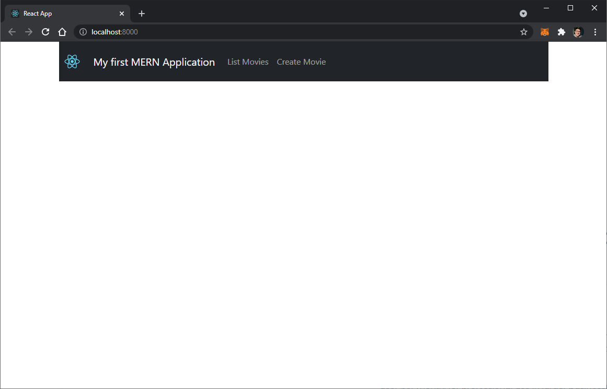

# Dockerized-MERN
A Dockerized MERN app, with basic CRUD operations. Based on the app detailed on the following post: https://medium.com/swlh/how-to-create-your-first-mern-mongodb-express-js-react-js-and-node-js-stack-7e8b20463e66

## Dependencies

The only dependency needed to setup this basic Docker development environment is Docker itself. Install Docker Desktop client from: [Docker Desktop for Mac and Windows](https://www.docker.com/products/docker-desktop).

## How to deploy the docker container (docker-compose)

### Initial setup

In order to deploy a container that will run the three different services (react-app, api-server and a local mongo database, as specified in *docker-compose.yml* file) that make up the basic development environment, execute the following command from a terminal in the root directory *DOCKERIZED-MERN*:

`docker-compose up --build`

This will build a container with all three images corresponding to each service. This is only necesarry the first time you initialize the container, and will take a couple of minutes to completely initialize.

In your browser, copy and paste the following into the address bar

`localhost:8000`

You should now see the following homepage:

Feel free to play around with the basic CRUD operations to verify everything is working correctly!

### Exit and restart the container

After the inital setup, the container can be safely stopped by the ctrl+c command on the terminal used to initialize it through the docker-compose command.

To start the container again, this can be done easily through the Containers/Apps tab on the Docker Desktop client, or through the following command from a terminal in the root directory *DOCKERIZED-MERN*:

`docker-compose start`

To stop the container in the same manner:

`docker-compose stop`